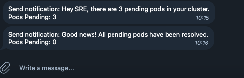
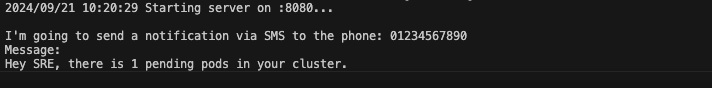
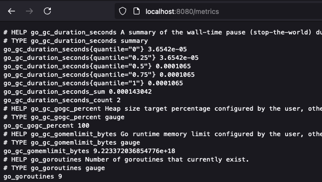
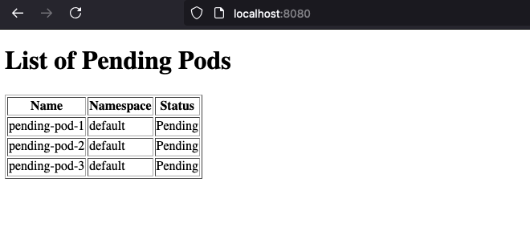
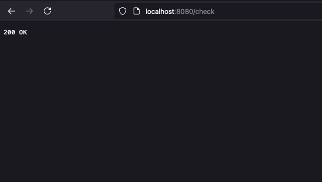
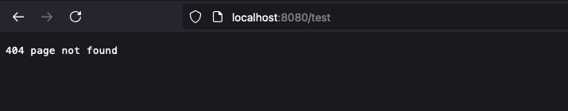

# README

## Multi-Channel notification/alerting System in Go by using the Adapter Design Pattern

## Disclaimer

This project is a `education only` project created solely for the purpose of `learning Go` and demonstrating the `Adapter Design Pattern` with Kubernetes.

The code and concepts presented here are for `educational` use only and are not intended for production environments or commercial applications. The sms's notification is `simulated` (stdout) to avoid incurring costs from external providers. 

## Overview

This project demonstrates the Adapter structural design pattern in Go by creating a multi-channel notification/alerting system. The system can send notifications through various channels: Email (external Gmail smtp provider), SMS(simulated with `fmt` - stdout), and Push Notification via Telegram bot.

The goal of the project is to show how the Adapter pattern can be used to integrate a new notification channel (Push Notifications) into an existing system that already supports Email and SMS, without changing the existing implementation.

Adapter Pattern: The Adapter makes the Push Notification system compatible with the existing notification system by "adapting" the external interface to the common Notifier interface.

## How the Application Works

The application checks for pending Kubernetes pods every minute by default(Hard coded for the moment).
If there are any pending pods, a notification is sent via Email, SMS(simulated by stdout to the console), and Push Notification via Telegram.
You can select by enable by change the constant (by default enableSms = true):

If the number of pending pods changes (e.g., from some pending to none), a new notification is sent.

Notification via Telegram bot:



Notification via Sms simulation(fmt out):



`Prometheus Metrics`: The application generate gauge metrics with Prometheus library then you can see the exposed metrics about the number of pending pods.

Metrics are exposed at `http://localhost:8080/metrics` 




`HTTP Server`: The application provides a simple HTTP server to view the current state of pending pods and check system health. Also by refreshing the page automatically will refresh the control pending pod.

Access the Http: Open your browser and go to `http://localhost:8080/` to see the pending pods



`http://localhost:8080/check` for a health check (return 200)



all the other http path return 400




## Notification/Alerting system implementation

you can choose to enable/disable:

```
const (
	enableSms              = true  // simulate by display terminal message due to cost - Default -
	enablePushNotification = false // via Telegram
	enableMail             = false // via Gmail SMTP
	kubeconfigPath         = ""
)
```

Email: External Gmail Smtp server. If you enable you must export `EMAIL_SENDER` and `GMAIL_APP_PASSWORD`
SMS: Simulated by printing to the stdout. (by DEFAULT)
Push Notifications via Telegram: if you want to use Telegram notification you need to setup a bot and then export environment variables: `TELEGRAM_BOT_TOKEN` and `TELEGRAM_CHAT_ID`

## Go Project Structure

`main.go`: The entry point of the application, which sets up the notification system, Prometheus metrics, and HTTP server.
`clientk8s/`: Manages Kubernetes client initialization.
`prometheus/`: Handles Prometheus metric exposure.
`push/`: Contains the Push Notification logic and the Adapter implementation.
`templates`: Basica Html code
`resources/`: Includes functionality for interacting with Kubernetes resources, like fetching pending pods.
`my-pending-pods-helm/`: contains helm-chart to test pod-pending
`testing-pending-pod/`: contains the manifest to test pod-pending

## How to Run and Pre requirement

To test you need to install `kind` for the semplicity of the project. Then you need to install `kubectl` and `make`.
The make file will automate the cluster creation and apply the pending pod manifests. You just need to run makefile `make apply-all`

Set up the environment: Make sure you have Go installed. Clone the repository and navigate to the project directory.

Run the application:

`go run *.go`
